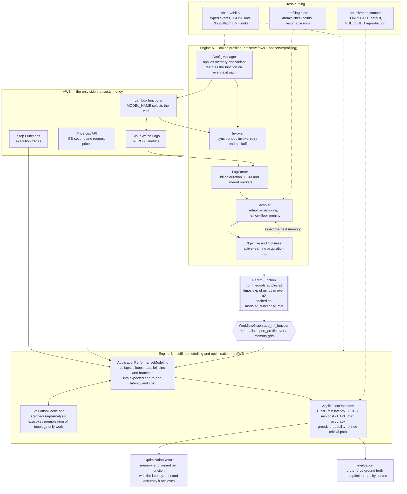
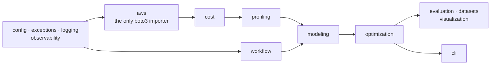

<p align="center">
  
</p>

# OptiServe

**OptiServe** is a system for **jointly optimizing cost, latency, and accuracy** in serverless applications with machine learning workloads. It supports complex application workflows composed of multiple functions, each with different performance and accuracy characteristics, and finds configurations that satisfy application-level constraints.

## ✨ Overview

Serverless computing simplifies deployment, but makes it harder to tune performance. OptiServe tackles this challenge by:

- Modeling latency and cost for both ML and non-ML functions.
- Capturing the impact of model accuracy on end-to-end workflow behavior.
- Solving tri-objective optimization problems using graph-based heuristics.
- Automatically identifying optimal memory and model choices for each function in a workflow.

## 🔍 Features

- **Tri-objective optimization** of serverless workflows (cost, latency, accuracy).
- **Performance modeling** through lightweight profiling.
- **Search space reduction** using critical paths and benefit-cost heuristics.
- **Support for workflows with branching, parallelism, cycles, and self-loops.**
- **Offline-testable core** — the modeling and optimization layers have no AWS or
  filesystem dependency; only live profiling touches AWS.

## 🏗 System architecture

OptiServe is two engines that meet at one point. **Engine A** measures a real
deployed function and fits a latency curve to it; **Engine B** reasons about a
whole workflow analytically and never touches AWS. The bridge between them is
`WorkflowGraph.add_ml_function`, which samples each fitted curve over a memory
grid to produce the discrete tables the optimizer searches.



**Reading the diagram.** Solid arrows are data flow; dotted arrows are
cross-cutting concerns that observe or configure a stage rather than sit in its
path. Everything below the `ParamFunction` boundary is pure: given the same
inputs it produces the same numbers, with no credentials and no network — which
is why the analytical half of the framework is fully testable offline.

### Layering

`boto3` is imported in exactly one package. Every layer to the right of it is
free of cloud dependencies.



## 🚀 Quickstart

Build a workflow, model it, and optimize it — no AWS needed (synthetic models and
injected pricing):

```python
from optiserve import WorkflowGraph, ModelVariant, ApplicationPerformanceModeling, ApplicationOptimizer

grid = [128, 256, 512, 1024, 2048]
f1 = [ModelVariant("small", lambda m: 900 - 0.1*m, accuracy=0.70),
      ModelVariant("large", lambda m: 1400 - 0.1*m, accuracy=0.95)]
f2 = [ModelVariant("fast", lambda m: 600 - 0.05*m, accuracy=0.60),
      ModelVariant("accurate", lambda m: 950 - 0.05*m, accuracy=0.92)]

workflow = (WorkflowGraph()
    .add_ml_function(1, f1, grid)
    .add_ml_function(2, f2, grid)
    .add_edges([("Start", 1, 1.0), (1, 2, 1.0), (2, "End", 1.0)])
    .validate())

app = ApplicationPerformanceModeling(workflow.to_networkx(), delay_type="SFN")
app.cost_calculator.aws_pricing_units = {"compute": 1.6667e-5, "request": 2e-7}  # or fetched from AWS

opt = ApplicationOptimizer(app)
result = opt.BPBC(budget=opt.maximal_cost, accuracy_constraint=0.75,
                  accuracy_formula=lambda a, b: (a + b) / 2)
print(result.response_time_ms, result.cost, result.memory_config, result.model_config)
```

The full runnable version is [`examples/optimize_workflow.py`](./examples/optimize_workflow.py).

## 📚 Documentation

- [Architecture](./docs/architecture.md) — layered design, dependency graph, data flow.
- [Target architecture & audit](./docs/TARGET_ARCHITECTURE.md) — the production
  redesign: what was wrong, what was measured, what changed, and what is still open.
- [Developer guide](./docs/developer_guide.md) — setup, tests, compat presets, profiling safely.
- [Deploying the benchmark functions](./experiments/README.md) — IAM prerequisites,
  `sam deploy`, and how each function selects its model variant.
- [`experiments/`](./experiments) — notebooks demonstrating the end-to-end research workflow.

## 🛠 How to install?

OptiServe is a standard Python package (`pyproject.toml`). We developed and
tested it on **Python 3.11**. AWS credentials are read from the standard AWS
credential chain (environment variables, `~/.aws/credentials`, or an instance
role); OptiServe never reads or stores them, and there is no `.env` file to
fill in. Pick a profile with the usual `AWS_PROFILE`, and point every client at
a local mock with `AWS_ENDPOINT_URL` — that one variable is how the offline
evaluation stack runs with no AWS account at all.

1. Clone the project and move into the root directory:

```bash
git clone https://github.com/2arian3/OptiServe.git
cd OptiServe
```

2. Install the package (editable install recommended for development):

<details open>
<summary><strong>Option A: Using pip (canonical)</strong></summary>

```bash
python -m pip install -e .                 # core library
python -m pip install -e ".[experiments]"  # + notebook / benchmark deps
```

</details>

<details open>
<summary><strong>Option B: Using Conda</strong></summary>

```bash
conda env create -f environment.yml
conda activate optiserve
```

</details>

<details open>
<summary><strong>Option C: Docker (no local Python needed)</strong></summary>

```bash
docker build --target runtime -t optiserve:latest .
docker run --rm optiserve:latest --help

# Or the full local stack: tests, mocked-AWS integration tests, lint, example.
docker compose run --rm tests
docker compose run --rm integration   # runs against a moto server, never real AWS
```

</details>

> Dependencies are declared once, in `pyproject.toml`. `requirements.txt` and
> `requirements-dev.txt` mirror them so Docker layers and CI caches key on a
> small, rarely-changing file; CI fails if they drift
> (`python scripts/check_requirements_sync.py`).

### Command line

Installing the package provides an `optiserve` command:

```bash
optiserve version
optiserve optimize --workflow examples/workflow_app3.json --strategy bpbc --accuracy 0.55
optiserve profile  --function my-lambda --yes --checkpoint-dir output/ckpt
```

`optimize` is fully offline and reads a declarative JSON workflow spec — it never
evaluates expressions from the file, so reading a spec is not equivalent to
running it. `profile` is the only command that touches AWS, and it refuses to
mutate a live function without `--yes`.

## ▶️ Using OptiServe

OptiServe has **two engines** you can use independently or together:

| Engine | When | Needs AWS? |
|--------|------|-----------|
| **Function modeling** | You have a deployed Lambda and want its latency-vs-memory curve per model variant | Yes (live profiling) |
| **Application modeling + optimization** | You have per-function performance models and want the best per-function memory/variant configuration for a workflow | No |

The typical flow is: **model each function → build the workflow → model the application → optimize**. Steps 2–4 are fully offline.

### 1. Model each function

Each function is described by one or more **model variants** (`ModelVariant`), each pairing a performance model (a callable `memory_mb → latency_ms`) with an optional measured accuracy.

You can supply the performance model in three ways:

```python
from optiserve import ModelVariant, ParamFunction

# (a) a plain callable (e.g. for what-if analysis)
v = ModelVariant("small", lambda mb: 900 - 0.1 * mb, accuracy=0.70)

# (b) a fitted curve loaded from the .mdl cache produced by profiling
pf = ParamFunction.load("modeled_functions/resnet_resnet-18.mdl")
v = ModelVariant("resnet-18", pf, accuracy=0.76)

# (c) fit one online by profiling a live Lambda (see "Profiling on AWS" below)
```

### 2. Build the workflow graph

`WorkflowGraph` is a probabilistic control-flow graph with `Start`/`End` sentinels and edge **transition probabilities**. `add_ml_function` is the bridge that materializes each node's discrete performance profile from its variants over a memory grid.

```python
from optiserve import WorkflowGraph, ModelVariant

grid = [128, 256, 512, 1024, 2048]
f1 = [ModelVariant("small", lambda m: 900 - 0.1*m, accuracy=0.70),
      ModelVariant("large", lambda m: 1400 - 0.1*m, accuracy=0.95)]
f2 = [ModelVariant("fast", lambda m: 600 - 0.05*m, accuracy=0.60),
      ModelVariant("accurate", lambda m: 950 - 0.05*m, accuracy=0.92)]

workflow = (
    WorkflowGraph()
    .add_ml_function(1, f1, grid)
    .add_ml_function(2, f2, grid)
    .add_edges([("Start", 1, 1.0), (1, 2, 1.0), (2, "End", 1.0)])
    .validate()
)
```

The graph supports **branching, parallel fan-out, cycles, and self-loops**. Edge weights are transition probabilities; a node may combine a probabilistic branch with a deterministic parallel fan-out (so out-edge weights need not sum to 1). For a fixed single-configuration node (no variants), use `add_function(node_id, memory_mb, response_time_ms)`.

### 3. Model the application

`ApplicationPerformanceModeling` analytically computes expected per-function execution counts, end-to-end response time, and cost — collapsing self-loops/cycles (`rt/(1−p)`), parallel joins (max), and probabilistic branches (expected value).

```python
from optiserve import ApplicationPerformanceModeling

app = ApplicationPerformanceModeling(
    workflow.to_networkx(),
    delay_type="SFN",
    cache_evaluations=True,     # memoize repeated evaluations (see below)
)

app.update_ne()                 # expected executions per node
rt = app.evaluate_avg_rt()      # graph reduction + end-to-end response time (ms)
cost = app.evaluate_avg_cost()  # expected cost (needs pricing — see below)
```

`delay_type` selects the transition-overhead model: `"None"` (0), `"SFN"` (AWS Step Functions overheads from `ModelingConfig`), or `"Defined"` (per-edge/node `delay` attributes).

`evaluate_avg_rt()` is `get_simple_dag()` followed by `get_avg_rt()` as a single
memoizable unit — both lower-level calls still work if you want them. With
`cache_evaluations=True` results are keyed on the *exact* per-node latency and
memory vectors, so a cache hit returns the bit-identical value a recomputation
would have produced. Measured at roughly 2x on the greedy strategies and on the
brute-force sweep, with byte-identical output; it is opt-in because the golden
baselines were captured with it off. `app.cache_stats()` reports hit rates.

### 4. Optimize

`ApplicationOptimizer` runs three greedy strategies. Each optimizes one objective under constraints on the other two and returns an `OptimizationResult` (a NamedTuple — use named fields or unpack the 6-tuple).

```python
from optiserve import ApplicationOptimizer

opt = ApplicationOptimizer(app)       # config=OptimizationConfig(...) to tune it
accuracy = lambda a, b: (a + b) / 2   # end-to-end accuracy from per-node accuracies

# BPBC — minimize latency under a budget and an accuracy floor
res = opt.BPBC(budget=opt.maximal_cost, accuracy_constraint=0.75, accuracy_formula=accuracy)

# BCPC — minimize cost under a latency ceiling and an accuracy floor
res = opt.BCPC(rt_constraint=opt.maximal_avg_rt, accuracy_constraint=0.75, accuracy_formula=accuracy)

# BAPB — maximize accuracy under a latency ceiling and a budget
res = opt.BAPB(rt_constraint=opt.maximal_avg_rt, budget=opt.maximal_cost, accuracy_formula=accuracy)

print(res.response_time_ms, res.cost, res.accuracy)
print(res.memory_config, res.model_config)   # {node: memory_mb}, {node: variant_index}
```

| Strategy | Optimizes    | Subject to          |
|----------|--------------|---------------------|
| `BPBC`   | min latency  | budget + accuracy   |
| `BCPC`   | min cost     | latency + accuracy  |
| `BAPB`   | max accuracy | latency + budget    |

`opt.minimal_cost / maximal_cost / minimal_avg_rt / maximal_avg_rt` give the feasible ranges to pick constraints from. 
Pass `BCR=True` with a `BCRtype` to prune the search space by benefit-cost ratio.
**The two strategies spell the modes differently**, and an unrecognized spelling
silently disables pruning rather than raising:

| strategy | accepted `BCRtype`           |
| -------- | ---------------------------- |
| `BPBC`   | `"RT/M"`, `"ERT/C"`, `"MAX"` |
| `BCPC`   | `"M/RT"`, `"C/ERT"`, `"MAX"` |

(`BPBA`/`BCPA` are accepted as historical aliases of `BPBC`/`BCPC`.)

### Accuracy: measured vs. ranked

If every variant on a node has a measured `accuracy`, the optimizer uses those values. If accuracies are omitted, it falls back to a **normalized rank** `i/N` (best variant = 1.0). The `accuracy_formula` receives per-node accuracy values positionally (in node order) and returns the end-to-end accuracy.

### Cost: offline or live pricing

`get_avg_cost` and the optimizer need Lambda unit prices. For offline/reproducible runs, inject fixed prices:

```python
app.cost_calculator.aws_pricing_units = {"compute": 1.6667e-5, "request": 2e-7}
```

Omit that line to fetch live prices from the AWS Price List API on first use (requires credentials). `CostCalculator(region=..., architecture="arm64")` selects region/architecture.

### Profiling on AWS (the online engine)

To fit a real function's curve, `FunctionPerformanceModeling` drives live profiling (it invokes the Lambda across memory sizes, parses CloudWatch REPORT logs, and fits a `ParamFunction`). This is the only path that touches AWS.

> **Profiling rewrites a live function.** It repeatedly changes the deployed
> function's `MemorySize`, `Timeout` and `MODEL_NAME`, and invokes it hundreds of
> times. Always use `profiling_session()`: it captures the original
> configuration before the first mutation and restores it on *every* exit path,
> including a crash or `Ctrl-C`.

```python
from optiserve import FunctionPerformanceModeling
from optiserve.profiling.state import JsonCheckpointStore

fm = FunctionPerformanceModeling(
    function_name="my-lambda",
    memory_bounds=(128, 3008),
    payload='{"key": "value"}',
    available_models=["resnet-18", "resnet-50"],   # optional ML variants
    checkpoint_store=JsonCheckpointStore("output/checkpoints"),  # resumable
)

with fm.profiling_session():                                # guaranteed restore
    model = fm.get_performance_model(model_name="resnet-18")  # fitted ParamFunction
    model.save("modeled_functions/my-lambda_resnet-18.mdl")
    best_memory = fm.get_optimal_memory(model_name="resnet-18")
```

An interrupted run resumes from its checkpoint instead of repaying for the
invocations it already made. Attach a sink to get a durable trace of what
happened:

```python
from optiserve.observability import JsonlSink, hooks
hooks.add(JsonlSink("output/run.jsonl"))
```

Multi-variant functions switch models via a `MODEL_NAME` environment variable,
which the profiler rewrites between measurements, and container deploys emit a
per-invocation marker log so `AWSFunctionLogs` (in `optiserve.aws`) can group
results by model. Not every benchmark function follows that convention — the
[deployment runbook](./experiments/README.md) says which ones do.

### Evaluation harness

`optiserve.evaluation` reproduces the paper's experiment artifacts and quality metrics:

```python
from optiserve.evaluation import generate_perf_cost_table, run_opt_curve, bpbc_optimization_accuracy
import numpy as np, pandas as pd

# Exhaustive ground-truth table over every (memory × variant) config
generate_perf_cost_table(opt, "perf_cost.csv")

# Sweep the strategies over constraint grids -> {prefix}_BPBC/_BCPC/_BAPB.csv
run_opt_curve(opt, "App", budget_list=list(np.linspace(opt.minimal_cost, opt.maximal_cost, 10)),
              performance_constraint_list=list(np.linspace(opt.minimal_avg_rt, opt.maximal_avg_rt, 10)),
              accuracy_constraint_list=[0.4, 0.6, 0.8], accuracy_formula=accuracy)

# How close is the greedy answer to the brute-force optimum? (percentage)
acc = bpbc_optimization_accuracy(pd.read_csv("App_BPBC.csv"), pd.read_csv("perf_cost.csv"),
                                 accuracy, ["f1_acc_value", "f2_acc_value"])
```

### Benchmark application

The committed App3 benchmark (`f1 → resnet → yolo`, with a back-edge and self-loop) reconstructs from the cached `.mdl` models:

```python
from optiserve.datasets import build_app3
workflow, accuracy_formula = build_app3()   # -> (WorkflowGraph, formula)
```

### Configuration & logging

Tunables live in `optiserve.config` dataclasses (`ProfilingConfig`,
`ModelingConfig`, `OptimizationConfig`, `AWSConfig`), and are read by the
components that own them — including `ProfilingConfig.noise_reduction`, which
turns off the sampler's variance-reduction substitution, and
`OptimizationConfig.compat`, which selects the optimizer behaviour preset.

The library configures no log handlers by default; enable output in
scripts/notebooks with:

```python
from optiserve.logging import configure_logging
configure_logging()   # INFO to stderr
```

### More

- **Runnable example**: [`examples/optimize_workflow.py`](./examples/optimize_workflow.py).
- **Deploying the benchmark functions**: the
  [runbook](./experiments/README.md) — IAM prerequisites, `sam deploy`, and the
  per-function differences in how a model variant is selected.
- **Reproducing the experiments**: the notebooks in [`experiments/`](./experiments).
- **Tests**: `make check` runs lint, type checking and the offline suite;
  `pytest -q` runs all 155 tests including the moto-backed AWS integration suite.
- **Reproducing published numbers**: the greedy optimizer ships two behaviour
  presets. The default is `CORRECTED`; pass
  `OptimizationConfig(compat=OptimizerCompat.PUBLISHED)` to reproduce the paper
  bug-for-bug, and say which preset produced any number you report. See the
  [developer guide](./docs/developer_guide.md#published-results-vs-corrected-results).

## 🗂 Project layout

```
optiserve/      the framework (aws, cost, profiling, modeling, workflow,
                optimization, evaluation, datasets, visualization,
                observability, cli)
experiments/    benchmark functions + evaluation notebooks
examples/       runnable usage examples + a declarative workflow spec
docs/           architecture, target design, developer documentation
tests/          unit, golden-master, and moto-backed integration tests
scripts/        maintenance utilities (dependency sync, .mdl migration)
Dockerfile      multi-stage: runtime (production) and dev (tests/CI)
docker-compose.yml   local stack: tests, mocked AWS, lint, example
.github/workflows/   CI: lint, types, matrix tests, integration, image, package
```
