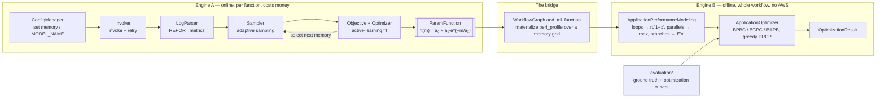
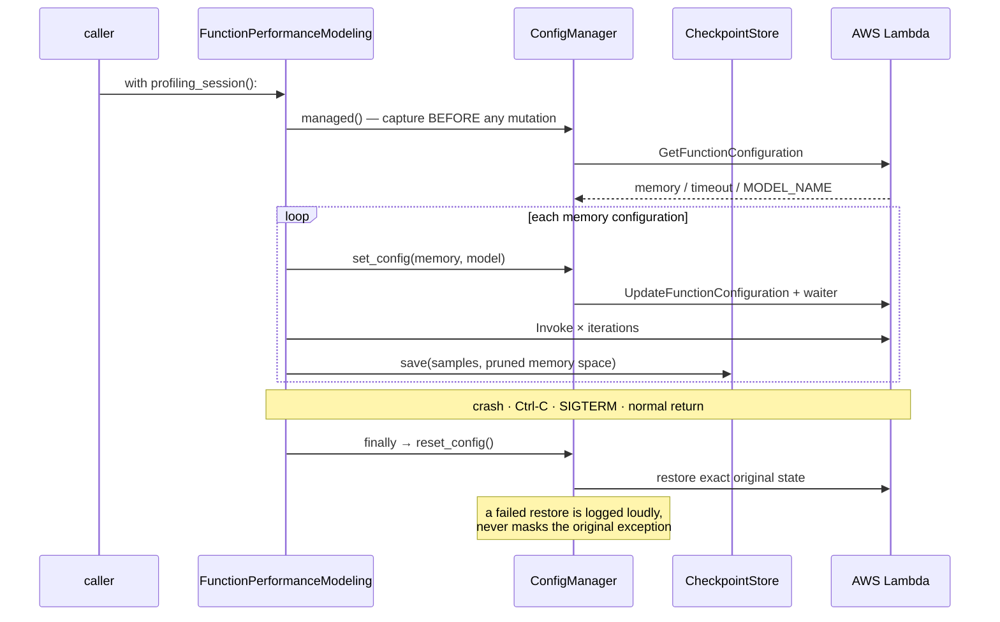
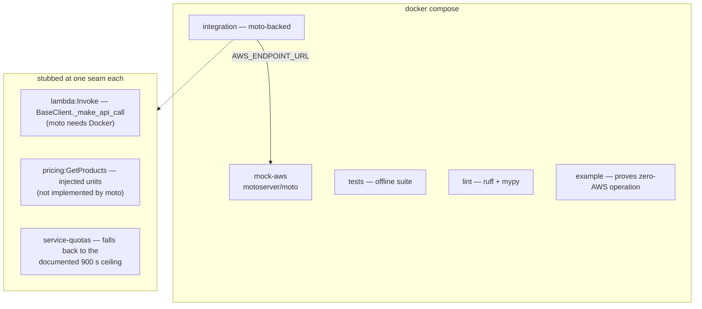
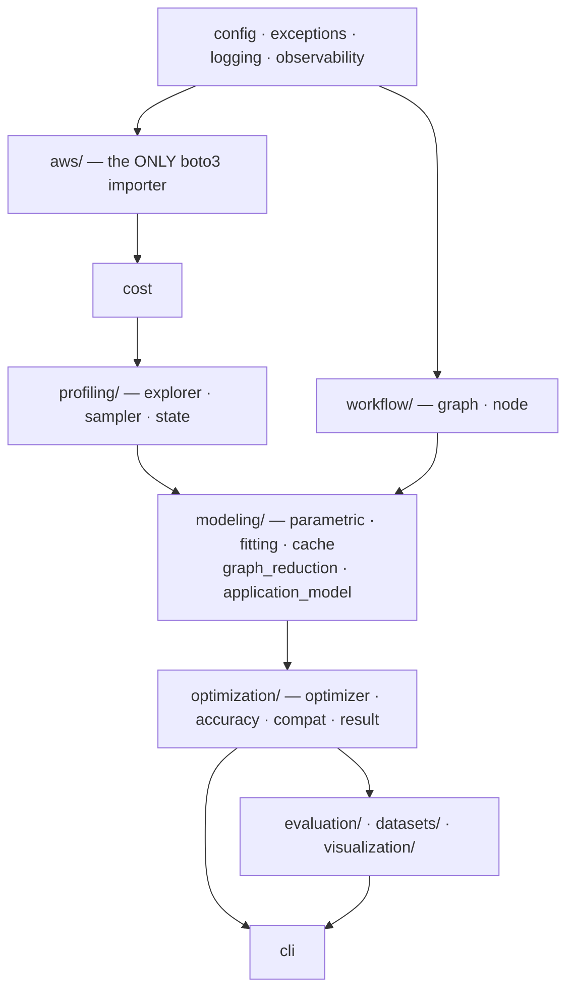

# OptiServe — Architectural Audit & Target Design

> Scope: a full read of every module, plus an empirical audit across six
> dimensions (optimization logic, the analytical core, AWS integration and state
> management, the profiling loop, testability, and productionization). Every
> finding below was reproduced against the code and then put through an
> adversarial review pass that tried to refute it; four claims did not survive
> and are recorded in [§2.6](#26-claims-that-did-not-survive-review) rather than
> quietly dropped.
>
> Measurements in this document were taken on the repository's own venv
> (CPython 3.11, macOS x86_64) and are reproducible from the commands given.

---

## 1. What OptiServe is, as built

OptiServe answers one question: **given a serverless ML workflow, which
per-function memory size and model variant optimizes one of {latency, cost,
accuracy} subject to constraints on the other two?**

It is two engines that meet at one point.



| Strategy | Optimizes | Subject to | Historical name |
|---|---|---|---|
| `BPBC` | min latency | budget + accuracy | `BPBA` |
| `BCPC` | min cost | latency + accuracy | `BCPA` |
| `BAPB` | max accuracy | latency + budget | — |

**AWS surface.** The entire framework touches nine operations across four
services. That precision is what makes a local, AWS-free evaluation stack
tractable — it is a small, enumerable seam, not "mock AWS".

| Service | Operations | Mockable by moto? |
|---|---|---|
| `lambda` | `GetFunctionConfiguration`, `UpdateFunctionConfiguration`, `Invoke`, waiter `function_updated` | config ✅, `Invoke` ❌ (needs Docker) |
| `logs` | `StartQuery`, `GetQueryResults`, `StopQuery` | ✅ |
| `pricing` | `GetProducts` | ❌ not implemented |
| `service-quotas` | `GetServiceQuota`, `GetAwsDefaultServiceQuota` | ❌ not implemented |

---

## 2. Critique and gap analysis

### 2.1 The profiler could not be pointed at anything that mattered

`ConfigManager.reset_config` had **zero callers anywhere in the repository** —
no context manager, no `finally`, no persistence of the captured initial state.
A profiling run rewrites a *live* function's `MemorySize`, `Timeout` and
`MODEL_NAME` hundreds of times; any crash, throttling storm or `Ctrl-C` left the
function on whatever the sweep happened to be probing. And even when called, it
could not restore a function that started *without* `MODEL_NAME`, because
`set_config(model_name=None)` means "leave it alone", not "remove it".

Compounding it: **botocore's default 60 s read timeout** against the 900 s
Lambda timeout the profiler itself sets. Any invocation over a minute surfaced
as a fabricated `FunctionTimeout`, and the sampler responded by pruning a memory
size that was never actually infeasible.

### 2.2 The measurement loop measured the wrong things

Three independent defects, each invisible offline:

- **OOM was never detected against real AWS.** The check is
  `Max Memory Used > Memory Size`, but the platform *clamps* reported usage at
  the configured limit, so a real OOM reports them as equal. The memory-floor
  pruning that makes profiling converge was therefore dead in production while
  passing its synthetic tests.
- **The CV-substitution step is selection on the outcome variable.** It keeps an
  extra invocation only if substituting it *lowers* the coefficient of
  variation. Over 4 000 simulated replications this removes ≈74 % of the sample
  variance and shifts the retained mean by ≈+1.3 %: the fitted curve looks far
  more precise than the measurements justify, and is slightly biased.
- **The curve fit was unbounded.** With a sparse or noisy sample set — exactly
  what the three-point seeding phase produces — `curve_fit` lands on
  non-physical parameters (`a₀ = −3.7 × 10⁵`, `a₁ = +3.7 × 10⁵`) that look fine
  inside the profiled window and go negative when extrapolated. `build_app3`
  extrapolates: it fits on ≤3 008 MB and materializes profiles out to 9 984 MB.
  The seed was also dimensionally wrong — `durations[0] // 10` used as a time, an
  amplitude *and* a decay constant in MB — which for a fast function evaluates to
  `[2, 2, 2]`, underflows `exp(−m/2)` to zero at every sampled memory, and leaves
  the exponential term with no gradient. The "fitted curve" is then a flat line.

  *(The 18 committed `.mdl` models are all well-behaved; this is a robustness
  defect, not a claim that published curves are wrong.)*

### 2.3 API-call amplification

`Invoker._invoke` issued a `GetFunctionConfiguration` before **every single
invocation**, for a value used only in a log line, and `_apply_config` issued a
`GetServiceQuota` for a constant on **every memory step**. For the default
2 881-step space at 4 invocations each that is ~14 000 avoidable control-plane
calls — and Lambda's control plane throttles long before that.

### 2.4 The optimizer recomputed what it already knew

Profiling the brute-force ground-truth sweep (1 728 configurations):

```
generate_perf_cost_table            3.78 s  cumulative
└─ evaluate_avg_rt      1728 calls  3.32 s   88 %
   └─ get_simple_dag    1728 calls  2.91 s   77 %
      ├─ simplify_loops             1.87 s   49 %
      │  └─ discover_cycles         1.25 s   33 %   ← topology-only
      └─ is_simple       3456 calls 0.81 s   21 %   ← topology-only
```

Cycle discovery and the `is_simple` predicate depend only on the node set, the
edge set and the transition probabilities — **never** on the per-node response
times the optimizer is varying. Together they are ~54 % of the runtime, spent
re-deriving answers for graphs that had not structurally changed.

### 2.5 Two optimizer defects that change the answer

Both confirmed by reproduction, both with verified fixes.

**BPBC never rebases its budget.** In phase 1, `current_cost` is set once and
never updated, while `surplus` is decremented by the same amount each iteration —
so from the second model upgrade onward, every prior upgrade is charged to the
budget twice. Measured on a 4-function chain where full accuracy is affordable
at 20 % of the cost envelope:

| budget (fraction of envelope) | published | corrected |
|---|---|---|
| 0.10 | 0.5000 | 0.6875 |
| 0.20 | 0.6250 | **1.0000** |
| 0.30 | 0.8125 | **1.0000** |
| 0.40 | 0.8750 | **1.0000** |

BCPC's equivalent loop *does* rebase, which is what makes this a defect rather
than a design choice.

**BAPB cannot buy accuracy without also buying memory.** Its candidate scan
breaks on `mem <= current_memory`, so a variant upgrade is only ever scored
*bundled with* a memory increase — the cheapest move, "switch to a better model,
keep the memory", is never evaluated. The exclusion is correct in BPBC phase 2
(same memory ⇒ no latency reduction) and was copied to BAPB, where the variant
dimension also changes.

### 2.6 Claims that did not survive review

Recorded because a rejected finding is as useful as a confirmed one:

| Claim | Why it was rejected |
|---|---|
| The `[ERROR]` regex missing `re.DOTALL` causes failed invocations to be recorded as valid samples | The regex is genuinely dead, but every path that would match already carries the same billed duration the caller returns. Inert. Fixed anyway; impact claim withdrawn. |
| `_invoke_once` can return `None` and poison the fit with `NaN` | No path can produce it — every catchable `InvocationError` carries a duration. A defensive guard was added; the failure mode was not real. |
| Regex-scraping the pricing JSON breaks on whitespace or scientific notation | Reproduced the cited inputs; they parse. Pagination and session reuse *were* real and are fixed. |
| The `--extra-index-url` for the PyTorch wheel index is a dependency-confusion vector | The file pins `--index-url` first; the extra index is additive and correctly scoped. |

### 2.7 Everything else

| Area | Finding |
|---|---|
| Security | The SAM templates hardcoded a deployment-specific 12-digit AWS account id, so they only ever deployed into one account. The role ARN is now built from `${AWS::AccountId}` and a `LambdaExecutionRoleName` parameter. |
| Config | `AWSConfig`, `ProfilingConfig` and `OptimizationConfig` were exported from the package root and read by nothing; the tunables they named were still inline literals. |
| Analytical core | The constructor mutated the *caller's* graph before copying it. `approximations` — the model's only record of where it is approximate — accumulated one duplicate per reduction and was surfaced only via `print()` from a method with no callers. |
| Search space | `range(low, high, step)` silently dropped the caller's stated maximum memory. |
| Acquisition | `update_knowledge` made one scalar `scipy.stats.norm.pdf` call per memory: 0.71 s per update at default bounds, versus 0.0005 s vectorized. |
| Termination | The sample budget counted *duration observations*, not memory configurations, so the default of 20 with 4 iterations profiled 5 configurations, not 20. |
| Objective | Held a stale reference to the memory space; the sampler prunes by *replacing* the array, so the confidence-based termination measured an argmin no longer in the search space. |
| Logs | Insights queries were abandoned rather than stopped on timeout (they hold a scarce concurrent-query quota), `Failed`/`Cancelled` were reported as timeouts, truncation at the row limit was silent, and Step Functions executions straddling the query window produced durations of ±10¹² ms. |
| Packaging | No CI, no container, no linter, no type checking, no console script, no `py.typed`. Coverage 73 %, with the entire live-AWS control plane at **zero**. |

---

## 3. Target design

Three principles, each answering a specific failure above.

### 3.1 Published results and correct results are different artifacts

The tension is structural: the golden battery locks published numbers
byte-for-byte, and the optimizer defects in §2.5 cannot be fixed without moving
them. Silently fixing rewrites history; silently keeping ships a known-wrong
optimizer.

The resolution is an explicit preset — `OptimizerCompat` — where every
divergence is one named flag, one `if` at the defect site, and a golden baseline
on *both* sides.

```python
OptimizerCompat.CORRECTED   # the default
OptimizerCompat.PUBLISHED   # bug-for-bug reproduction
```

Reproducing a figure therefore reads as a statement of intent:

```python
ApplicationOptimizer(app, config=OptimizationConfig(
    compat=OptimizerCompat.PUBLISHED))
```

`optimizer_baseline.json` is unchanged and now explicitly means "the published
path"; `optimizer_baseline_corrected.json` freezes the fixed path. A test
asserts the two actually differ, so the flags cannot decay into no-ops.

### 3.2 State is owned, not assumed



- **Restoration** is a `finally`, not a convention. `managed()` captures
  eagerly, on entry, before the first mutation. The CLI additionally converts
  `SIGTERM` into `KeyboardInterrupt` so a container stop still unwinds.
- **Resume** is keyed by a run id that fingerprints the run's *parameters*
  (payload, iterations, CV settings). Changing any of them starts a new run
  rather than blending incomparable measurements into one curve. Checkpoints are
  written atomically (`tmp` + `os.replace`) — being killed mid-write is the
  exact scenario they exist for.
- **Idempotency**: re-running a completed configuration is a checkpoint hit, not
  a re-invocation. The pruned memory space is part of the saved state, so a
  resumed run does not re-probe sizes already proven infeasible.

### 3.3 Profiling hooks

Every interesting transition emits a typed `Event` through a registry that
**cannot fail a run** — sinks are called inside a `try/except` that swallows
everything but `KeyboardInterrupt`/`SystemExit`, and an empty registry makes
`emit` a single truthiness check.

```
profiling.run.{started,finished}          modeling.fit.{updated,failed}
profiling.config.{applied,restored}       modeling.acquisition.selected
profiling.invocation.{completed,failed}   optimization.{started,finished,step}
profiling.sample.recorded                 optimization.model_evaluation
profiling.memory.pruned                   optimization.cache_stats
profiling.checkpoint.{saved,resumed}
```

Four sinks, one per situation OptiServe actually runs in: `InMemorySink`
(assertions), `LoggingSink` (a human watching a run), `JsonlSink` (the durable
per-run audit trail, flushed per event so a killed run still leaves a usable
trace), and `EmfSink` — CloudWatch Embedded Metric Format, because when the
driver runs inside Lambda or Fargate, stdout *is* the metrics pipeline and
`PutMetricData` would add an API call and a cost to every profiling invocation.

### 3.4 Memoization that cannot change an answer

Two caches, both keyed on the **exact** float tuple, so a hit returns the
bit-identical value the recomputation would have produced — no tolerance, no
rounding:

| Cache | Key | Rationale |
|---|---|---|
| `evaluate_avg_rt` | per-node `rt` vector | the reduction is a pure function of it |
| `evaluate_avg_cost` | `(ne version, rt vector, mem vector)` | `update_ne` bumps the version and clears |
| `CachedGraphAnalysis` | node order + edge order + weights | cycle discovery and `is_simple` are topology-only (§2.4) |

The topology key captures node and edge *iteration order*, not just the sets:
networkx enumerates cycles in that order and the reduction mutates the graph
while walking the result, so an order-insensitive key would be a correctness bug
rather than an optimization.

The one hazard — a cache hit skips the reduction, leaving `simple_dag`
describing a *different* configuration — is closed by tracking which
configuration the reduced graph belongs to; `get_avg_rt()` and
`get_approximations()` rebuild rather than answer from a stale graph.

**Measured**, with output asserted identical by `tests/test_cache_equivalence.py`:

| workload | uncached | cached | speed-up |
|---|---|---|---|
| greedy strategies, acyclic | 24 ms | 14 ms | 1.8× |
| greedy strategies, cyclic | 122 ms | 46 ms | 2.6× |
| brute-force sweep, 1 728 configs | 1 940 ms | 1 027 ms | 1.9×, byte-identical CSV |

Caching is **opt-in** (`cache_evaluations=True`) because the default path is the
one golden baselines were captured on; the CLI and the example enable it.

### 3.5 The local, AWS-free evaluation path

The seam is the **endpoint**, not an injected fake: every client is built through
`create_client`, which honours `AWS_ENDPOINT_URL`. No library code knows whether
AWS is real.



What is *not* mocked is the point: `ConfigManager`, `Invoker` retry/backoff,
`LogParser`, `Explorer`, `Sampler`, the acquisition loop and the curve fit all
run as real code in the integration suite.

The suite runs against **both** backends — in-process `mock_aws()` by default, a
moto server over HTTP when `AWS_ENDPOINT_URL` is set. That is not redundancy:
the in-process mock patches botocore from the inside, so it cannot catch a
client built with the wrong endpoint or a stale cached client. The server leg
found exactly such a defect during this work — a Service Quotas call that
returns a retryable error costs ten adaptive retries with backoff on the
profiling critical path, before falling back to a value that was always
available. That client now gets a short retry budget.

### 3.6 Layering



`boto3` appears only under `aws/`. Everything from `workflow/` rightward is pure
and runs with no credentials — which is why 84 % of the suite needs no network.

---

## 4. What changed, and what it addresses

| Change | Addresses |
|---|---|
| `ConfigManager.managed()` + `profiling_session()`; `SIGTERM` handling in the CLI | §2.1 unrestored live functions |
| `reset_config` removes `MODEL_NAME` when it was absent | §2.1 |
| `read_timeout = 900 s`, adaptive retries, `AWS_ENDPOINT_URL` | §2.1, §3.5 |
| OOM markers in `LogParser` | §2.2 dead memory pruning |
| `ProfilingConfig.noise_reduction` (documented bias, default preserves published behaviour) | §2.2 |
| Bounded fit `[0, 0, 10⁻³]` + dimensionally correct seeding | §2.2 |
| Cached quota with a short retry budget; `Invoker` reads config through a provider | §2.3 |
| `CachedGraphAnalysis` + evaluation caches | §2.4 |
| `OptimizerCompat` presets + a corrected golden baseline | §2.5 |
| SAM templates parameterized | §2.7 security |
| `ProfilingConfig`/`AWSConfig`/`OptimizationConfig` wired through | §2.7 |
| Constructor copies the caller's graph; `approximations` reset per reduction; `print` → logging | §2.7 |
| Inclusive memory bounds + Lambda min/max validation | §2.7 |
| Vectorized `update_knowledge` (1 300×, bit-identical) | §2.7 |
| Termination counts configurations; `Objective` reads the live space | §2.7 |
| Logs: `StopQuery`, typed failures, truncation warning, window-straddling executions dropped | §2.7 |
| Dockerfile, compose, CI, ruff, mypy, `py.typed`, `optiserve` CLI | §2.7 |

---

## 5. Verification

```
155 tests   137 offline (incl. 8 golden) + 18 integration, the latter run twice:
            in-process moto and a moto server over HTTP
coverage    85 % with the integration suite, 80 % offline-only (was 73 %)
            optiserve/aws/ was 0 %: now 76-100 % per module
ruff        clean        mypy  clean (48 files)
```

The claims in this document are executable:

```bash
make check                                   # lint + types + deps + offline suite
pytest -q -m integration                     # moto-backed AWS adapters
pytest -q tests/test_cache_equivalence.py    # the cache changes no answer
pytest -q tests/test_optimizer_compat.py     # the presets differ as described
python tests/golden/regenerate.py --all      # every baseline reports "unchanged"
```

---

## 6. What this design does not fix

Stated explicitly, because a design document that only lists wins is not useful.

1. **The SAM templates are parameterized, not audited.** Building the role ARN
   from `${AWS::AccountId}` stops a deployment-specific identifier from being
   committed again, but nothing in CI enforces that. A pre-commit or CI check
   that rejects 12-digit literals in `experiments/functions/*/template.yaml`
   would make the invariant hold rather than merely be true today.

2. **`get_simple_dag` can fail to converge.** Its reduction loop has a
   `break`-with-warning guard for graph shapes the passes cannot handle, and the
   audit found shapes where `simplify_branches` reports progress for a no-op
   weight write. Fixing the reduction engine changes published numbers on every
   cyclic graph, so it belongs behind its own compat flag with its own baseline —
   not bundled into this change.
3. **The `.mdl` cache is load-bearing, gitignored, and unregenerable** without
   live AWS. Lookup is now robust and errors are actionable, but the artifacts
   themselves are still outside version control.
4. **The CV-substitution bias is documented and switchable, not removed.** The
   published results were produced with it on; deciding the protocol for future
   campaigns is a research decision, not an engineering one.
5. **Two remaining compat-gated defects are not yet implemented** — the BCPA
   phase-order leak and the BCR alias namespace mismatch (the latter means the
   `BCR_M/RT` and `BCR_C/ERT` columns of every published curve are BCR-*disabled*
   reruns). The flag exists; the gates do not.
